# 基于 Vue 和 SpringBoot 的高校固定资产管理系统

## 软件简介

基于 Vue 和 SpringBoot 的高校固定资产管理系统，用于实现高校对固定资产的管理需求，包含**资产品类、资产单位、资产仓库、资产供应商、资产库存、资产采购、资产采购审核、资产报修**这八大模块，另外还包括了用户管理、日志管理、数据字典管理、组织架构管理、角色权限管理等基础模块，**支持数据的增删改查和导出功能**。

高校固定资产管理系统可以给**资产管理员、资产采购专员和资产审核专员**这三个角色使用，资产管理员负责维护基础档案和监控资产情况，资产采购专员用于按需发起资产采购订单，资产审核专员用于审核采购订单，审核后由采购专员完成指定仓库的入库操作。

项目需求：

1. 借助互联网的优势力量使高校资产主管部门能方便的对其管辖内的固定资产使用情况进行查询、统计等操作。
2. 能够借助校园网对本校的固定资产采购、登记、维修、报废等所有环节进行行之有效的监管，并对于资产的使用情况进行有效地整合和控制，以实现固定资产的全面、实时管理。
3. 对于各类精密仪器的种类、数量、分布、使用情况等进行经常性分析、研究和汇总，及时掌握教学科研对精密仪器的提出的具体要求等，对各种数据进行统计上报，并借助于先进的计算机网络技术，实现数据的传输,从保证对固定资产实施科学、高效的管理。

如您对该项目有技术问题或建议，欢迎在 <https://bbs.csdn.net/topics/611909458> 贴吧中进行反馈，谢谢！

## 登录页

## 注册页

## 首页

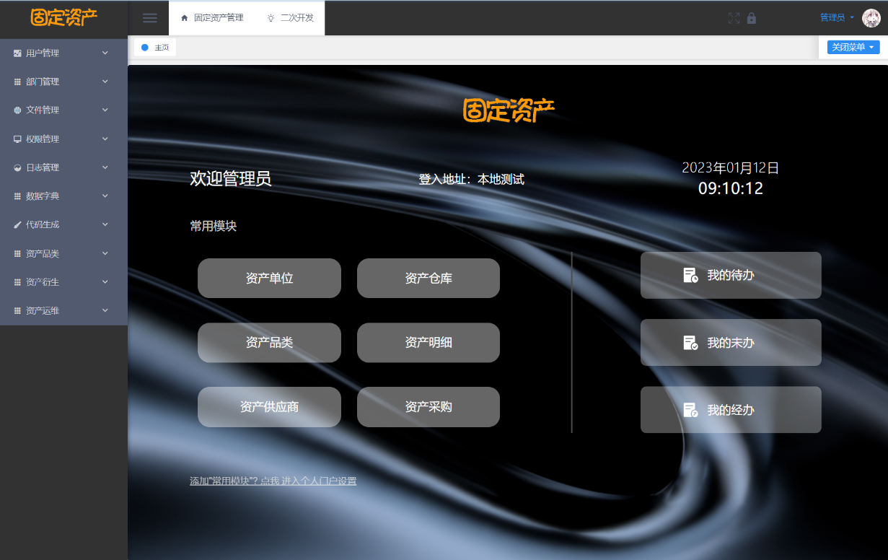

## 资产单位模块

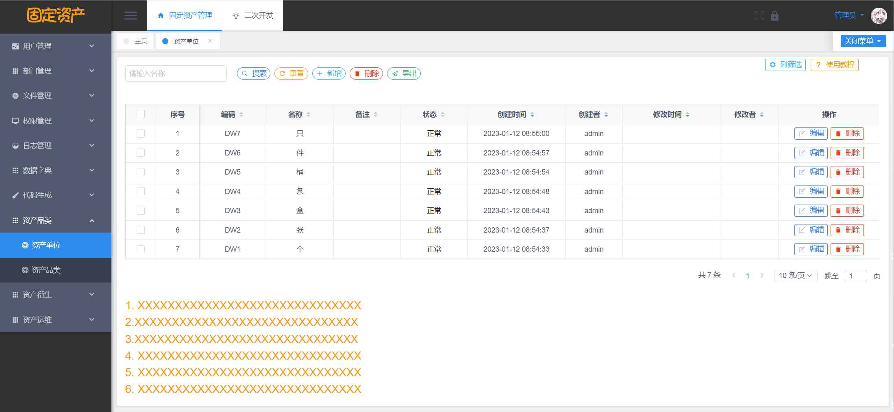

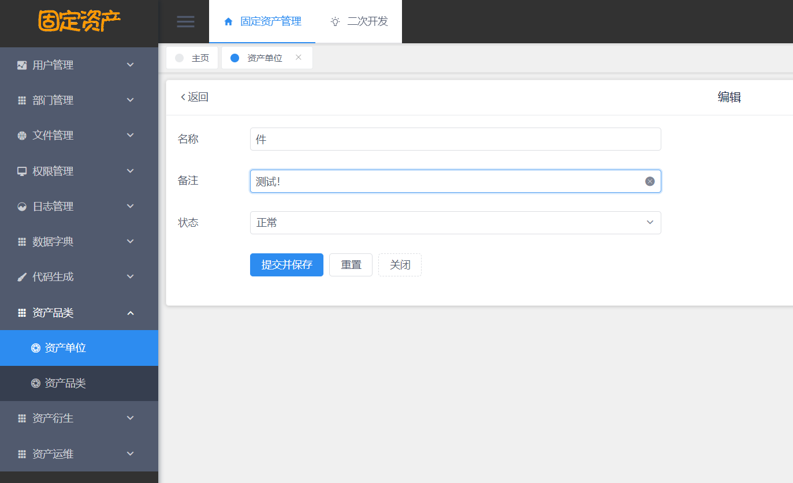

## 资产供应商模块

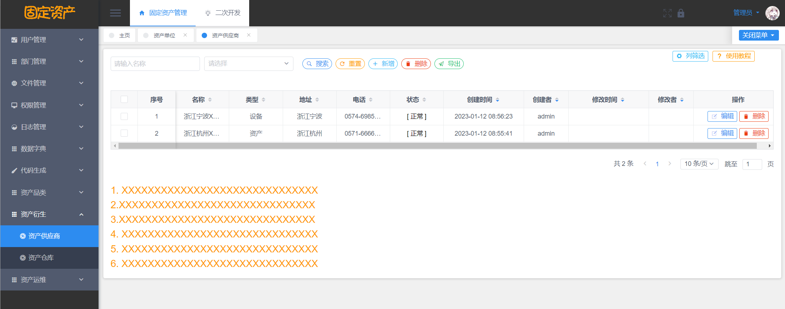

## 资产仓库模块

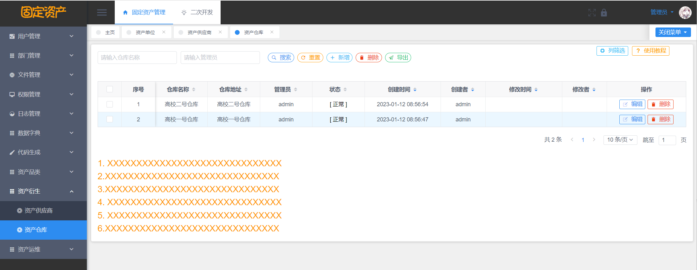

## 资产品类模块

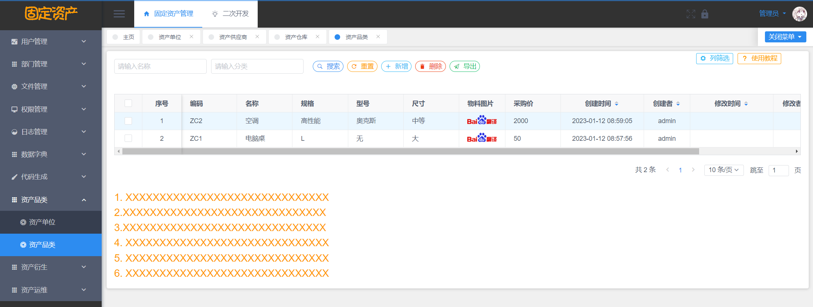

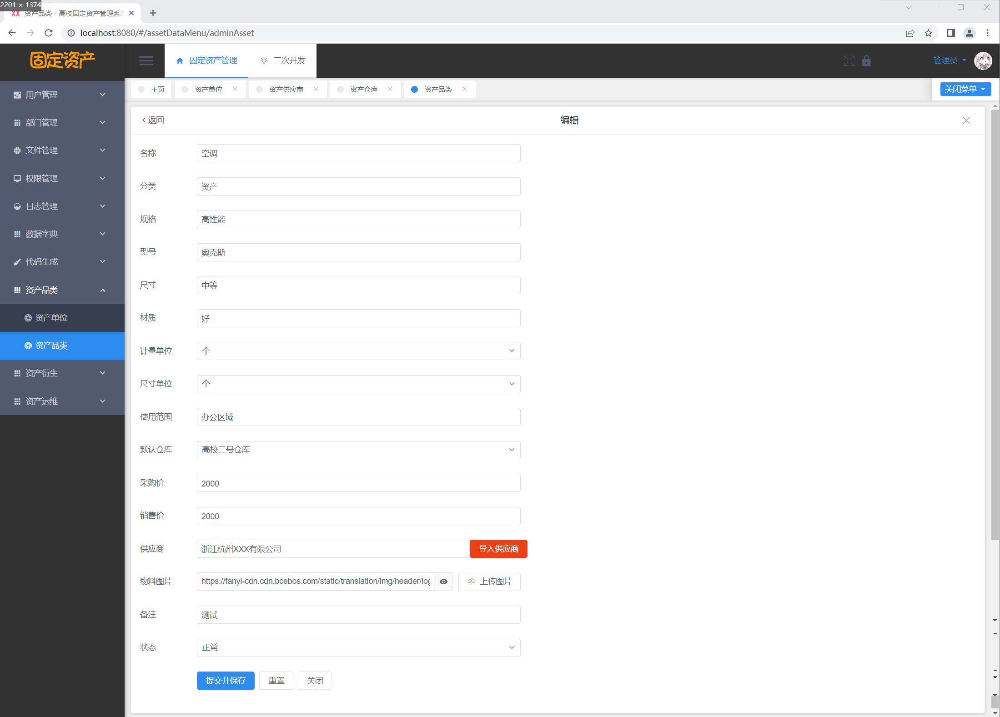

## 资产库存模块

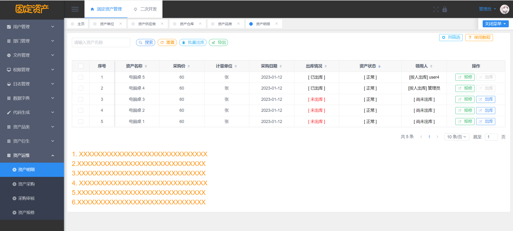

## 资产采购模块

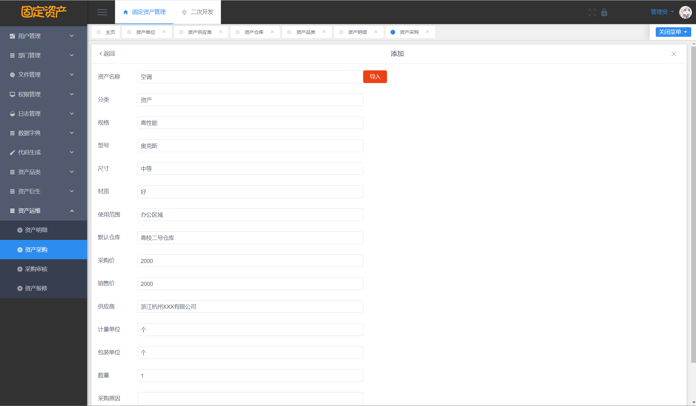

## 提交审核

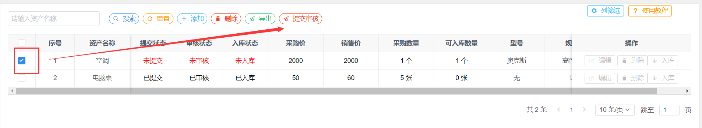

## 资产审核模块

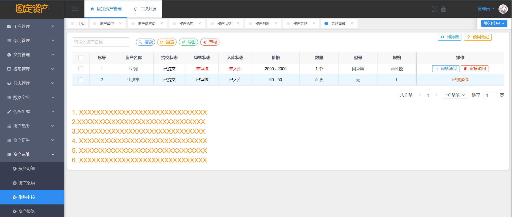

## 资产入库

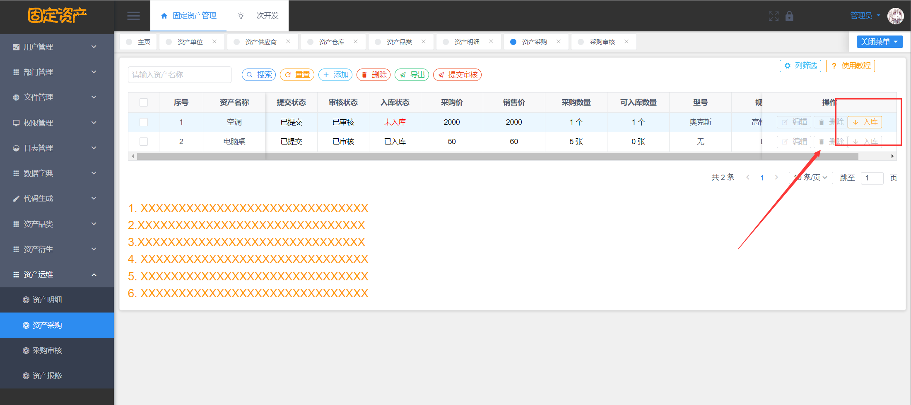

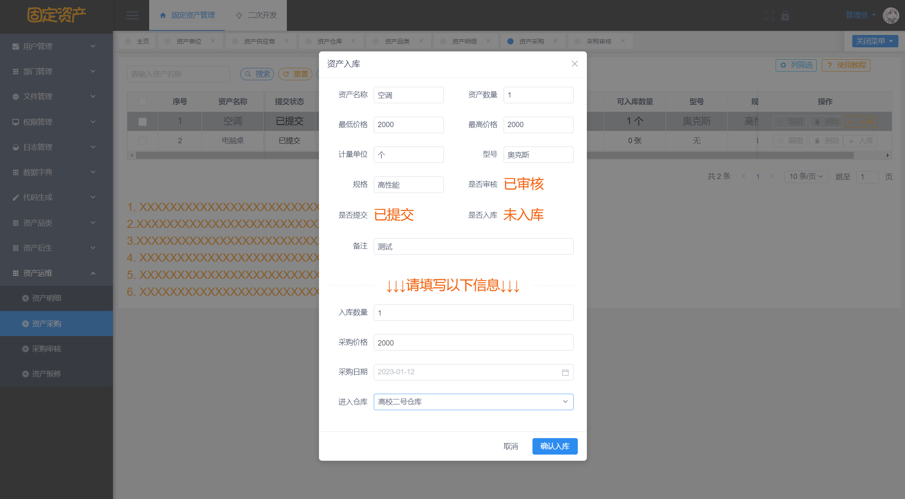

## 资产领用出库

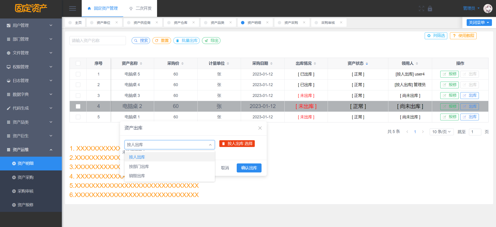

## 资产报修

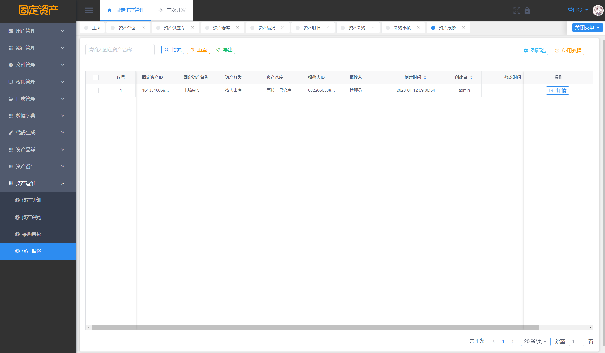

## 免责声明

- 本项目开源，仅供个人学习使用，遵循 GPL-3.0 开源协议，**转发 / 商用授权请联系作者，否则后果自负**。
- 作者拥有本软件构建后的应用系统全部内容所有权及独立的知识产权。
- 如有问题，欢迎在仓库 Issue 留言，看到后会第一时间回复。相关意见会酌情考虑，但没有一定被采纳的承诺或保证。

下载本系统代码的用户，**必须同意以下内容，否则请勿下载**！

1. 出于自愿而使用/开发本软件，了解使用本软件的风险，且同意自己承担使用本软件的风险。
2. 利用本软件构建的网站的任何信息内容以及导致的任何版权纠纷和法律争议及后果和作者无关，作者对此不承担任何责任。
3. 在任何情况下，对于因使用或无法使用本软件而导致的任何难以合理预估的损失（包括但不仅限于商业利润损失、业务中断与业务信息丢失），作者概不承担任何责任。
4. 必须了解使用本软件的风险，作者不承诺提供一对一的技术支持、使用担保，也不承担任何因本软件而产生的难以预料的问题的相关责任。
